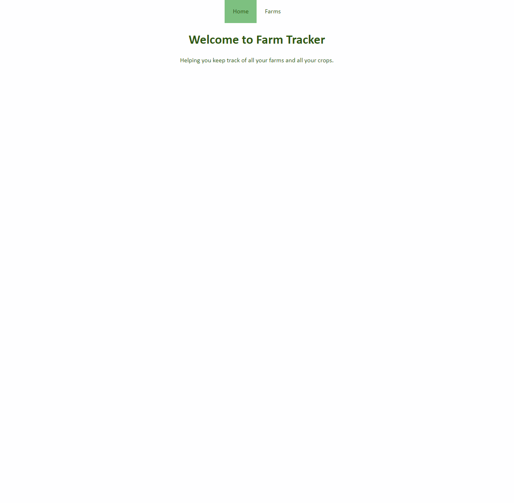

## Farm Tracker

The Farm Tracker maintains a record of the production beds on a number of farms. Users can select a farm to view it's production beds, with details about each bed's square footage, crop, anticipated days to maturity, planting and harvesting dates. Users can add both farms and beds to the tracker, as well as remove them. Users may also update the name and location of a farm.

## Features

<a href="https://youtu.be/rj4ag97Kfh4" alt="app video">Click here for a demo video of the app.</a>
  
<a href="https://farm-tracker.onrender.com"
alt="deployed app link">See the app deployed on Render.</a>
  

Users can:

- View a list of all farms in the tracker
- View a farm's production beds and their details
- Add/Remove/Update farms
- Add/Remove beds

## Available Scripts

## Backend

From the project directory you can run:

### `bundle`

Installs all of the ruby gems associated with backend.

### `bundle exec rake db:migrate`

Runs the migrations to setup the database.

### `bundle exec rake db:seed`

Seeds the database tables with sample data.

### `bundle exec rake db:reset`

Drops the database tables and reseeds them with sample data.

### `bundle exec rake server`

Starts a local server to serve the database.

### `ctrl + c`

Stops the server.

## Frontend

From the frontend directory you can run:

### `npm i`

Installs the dependencies for the app.

### `npm start --prefix client`

Runs the app in the development mode.\
Open [http://localhost:4000](http://localhost:4000) to view it in your browser.

## For Contributors
If you'd like to contribute to this project, you may clone this repo and submit your changes for approval to codybarker.or@gmail.com

##  Support
e: codybarker.or@gmail.com

## Project Status
In development and unlicensed

## Author
Cody Barker